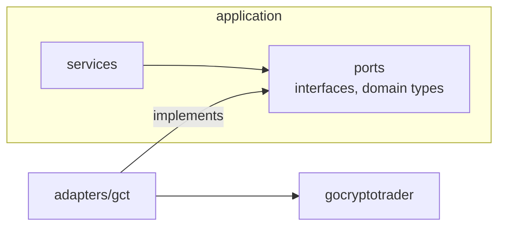

# 0003: gocryptotrader quarantined behind ports

**Status:** accepted (2026-07-02); partially superseded by 0010 (compound `ports.Exchange` and capability-erasing resilience wrappers)

## Background: the dependency problem this solves

gocryptotrader (GCT) is an open-source framework that speaks the APIs of dozens of cryptocurrency exchanges. Using it means one integration instead of dozens. The danger is its size: GCT is not a library, it is a framework with its own engine, configuration system, database layer, and opinions about how a trading program should be structured.

The legacy generation of this codebase (ADR-0001) used GCT directly everywhere, and that is precisely how it decayed: GCT's types appeared in function signatures across every layer, so a GCT upgrade with a breaking change meant touching the whole program, and replacing GCT for even one exchange was unthinkable because nothing separated "our logic" from "GCT's shapes". A dependency that everything touches effectively owns your codebase.

## The pattern: ports and adapters

The fix is an old architectural idea, most commonly called ports and adapters (or hexagonal architecture). Two definitions:

- A **port** is an interface owned by the application, written in the application's own domain types, describing a capability it needs. Example from `internal/ports`: `AccountReader` with `Balances(ctx, accountType) ([]account.Balance, error)`. Nothing in that signature knows GCT exists.
- An **adapter** is the one package that implements a port using a specific external technology. `internal/adapters/gct` implements the exchange ports using gocryptotrader.

The dependency direction is the whole point:



Services depend on ports. The adapter depends on the ports and on GCT. GCT is depended on by exactly one package. Swap the adapter and nothing above it changes; that is what makes per-venue native adapters possible later without touching a single caller.

## Decision

- All application code depends only on the interfaces in `internal/ports` (`Exchange`, `MarketDataReader`, `AccountReader`, and since manual trading also `OrderPlacer` and `PrivateStreamer`), using pure domain types.
- GCT is imported only inside `internal/adapters/gct/`. This is enforced mechanically by a depguard rule in `.golangci.yml`, so an accidental import elsewhere fails `make lint` and CI. Boundaries kept by convention erode; boundaries kept by a linter do not.
- The adapter boots a trimmed GCT engine: the exchange manager only, with GCT's web UI, database, and comms subsystems disabled. It runs under the fx lifecycle like every other component.
- `convert.go` is the single place where GCT types and domain types meet, and it is tested heavily. This is also where GCT's float64 amounts are converted to `shopspring/decimal` (ADR-0002): float enters at the boundary and does not travel further.
- The adapter translates GCT's failures into a small set of typed domain errors: `ErrVenueUnavailable`, `ErrAuth`, `ErrRateLimited`, later `ErrNotFound` and `ErrTradingUnsupported`. Callers classify failures with `errors.Is` against these sentinels and never parse GCT error strings. This matters operationally: the circuit breaker must distinguish "the venue is down" (should open the circuit) from "my API key is wrong" (should not), and it can only do that if the adapter names the difference. The classifier in code, to make the shape concrete:

```go
// internal/exchange/registry.go: which errors count as venue failures.
// Everything listed is "not the venue's fault" and must not open the circuit.
func isBreakerSuccess(err error) bool {
    return err == nil ||
        errors.Is(err, ports.ErrAuth) ||               // our key is wrong
        errors.Is(err, ports.ErrUnsupportedAccount) || // our config is wrong
        errors.Is(err, ports.ErrNotFound) ||           // a real answer: "no such order"
        errors.Is(err, context.Canceled) ||            // we hung up, not them
        errors.Is(err, errLimiterWait)                 // our own throttle
}
```

  Every entry in that list was a decision, and one (`ErrNotFound`) was added after review caught that routine reconciliation lookups would otherwise open the circuit and block trading. Typed errors are what make such a list possible at all; with string matching it would be a pile of regexes over another project's wording.

- The depguard rule that enforces the boundary, from `.golangci.yml`, so you know what firing looks like:

```yaml
depguard:
  rules:
    gct-quarantine:
      list-mode: lax
      files:
        - "!**/internal/adapters/gct/**"
      deny:
        - pkg: github.com/thrasher-corp/gocryptotrader
          desc: gocryptotrader may only be imported inside internal/adapters/gct (ADR-0003)
```

## Resilience layering

Venue protection is built outside the adapter on purpose, in this order from caller to venue:

```
service retry (backoff/v5)
  -> circuit breaker per venue (gobreaker/v2)
    -> rate limiter (x/time/rate)
      -> gct adapter -> venue
```

Each layer has one job, and the order is not arbitrary:

| Layer | Job | Why this position |
|---|---|---|
| retry | reissue a failed call with exponential backoff | outermost, so a retry passes through the breaker again and an open circuit stops the retry storm |
| circuit breaker | after repeated failures, fail fast without calling the venue | before the limiter, so rejected calls do not consume rate budget |
| rate limiter | cap requests per second to the venue's documented limits | last before the adapter, so everything above shares one budget |

GCT has an internal rate limiter of its own; it is treated as a bonus, never as the only guard, because its correctness is exactly the kind of framework internal this ADR refuses to depend on.

## Working on the adapter

GCT's behavior is discovered from its source, not guessed: the GCT checkout lives at `~/github/gocryptotrader` and is indexed with GitNexus for adapter work (see AGENTS.md). Two recurring facts worth knowing before touching the adapter: GCT's order and balance types carry float64 (convert at the boundary), and GCT owns websocket reconnection internally (the adapter observes connection state rather than managing sockets).

## Consequences

- A venue migrates to a native adapter by implementing the same ports; no caller changes. This is the escape hatch that the legacy code lacked.
- Our domain types mirror some GCT concepts, which is duplication. That duplication is the price of independence and is paid on purpose.
- The depguard rule turns an architectural intention into a build failure, which is the difference between a boundary and a suggestion.
