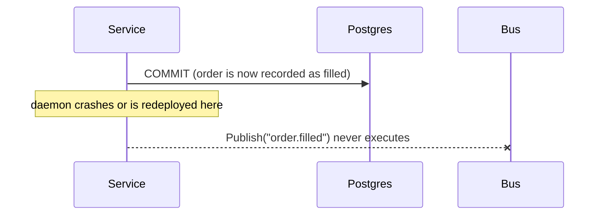

# 0008: Transactional outbox for order events; state row plus transition log

**Status:** accepted (2026-07-05)

## Background: the two systems involved

To follow this ADR you need to know two components of the daemon.

**Postgres** is the system of record (ADR-0004). Every order, every state transition, and every fill is a row. If Postgres and anything else disagree, Postgres is right.

**The event bus** is a small publish/subscribe mechanism inside the daemon process (`internal/bus`, ADR-0005). A publisher calls `Publish` with a subject string such as `order.filled` and a payload. Every subscriber whose prefix matches receives the event on its own channel. It exists so that components can react to each other without importing each other: for example, the reconciliation loop subscribes to `stream.reconnected` so it can run a check immediately after a websocket reconnects. Two properties of this bus matter here:

1. It is in-process. If the daemon dies, the bus and everything in flight on it is gone.
2. It drops events instead of blocking. Each subscriber has a buffer of 64 events; when the buffer is full because the subscriber is slow, new events for it are discarded and a counter is incremented.

Property 2 is a feature for telemetry-style events. A dropped balance snapshot notification costs nothing, since another snapshot follows a minute later. Order events do not have that luxury. A fill event drives the inventory ledger and any future consumer, and a lost fill means silently wrong bookkeeping with nothing to detect it.

The question this ADR answers: how does an order event get from a database commit onto the bus with a guarantee that it is never lost, given that the bus itself provides no such guarantee?

## Why "commit, then publish" cannot work

The first design anyone writes is: commit the transaction, then call `Publish`. This is called a dual write, because it updates two independent systems (the database and the bus) one after the other. Between the two writes the process can die:



After the restart, the database says the order filled, no event was ever published, and no error was recorded anywhere, because from the database's point of view nothing failed. Every consumer that should have reacted to that fill is now permanently behind.

Swapping the order does not help. Publish first and the crash can happen before the commit: now consumers reacted to a fill that the database never recorded, which is worse.

There is no ordering of two independent writes that fixes this. The fix has to be structural: perform only one write, and derive the second delivery from it.

## The decision: an outbox table

The event is written into the database itself, as a row in an `outbox` table, inside the same transaction as the order change. The table:

| Column | Type | Purpose |
|---|---|---|
| `id` | bigint identity | ordering; events are relayed in commit order |
| `subject` | text | the bus subject, for example `order.filled` |
| `payload` | jsonb | the event body |
| `created_at` | timestamptz | when the row was written |
| `published_at` | timestamptz, NULL | NULL until the relay has delivered it |

A concrete example. When a venue reports a fill, `OrderStore.ApplyEvent` runs one transaction that writes the order row update, the transition row, the fill row, and this outbox row:

```json
{
  "client_order_id": "01JG3AC9GVX0P5S6K8ZT2M4Q7R",
  "venue": "coinbase",
  "base": "BTC",
  "quote": "USDT",
  "status": "partially_filled",
  "filled_qty": "0.4",
  "qty": "0.4",
  "price": "50000"
}
```

Because everything is one transaction, there are exactly two possible outcomes:

| Outcome | Order state written | Outbox row written | Effect |
|---|---|---|---|
| commit succeeds | yes | yes | the event will be delivered |
| crash or rollback before commit | no | no | the event never happened, so there is nothing to deliver |

There is no third state. The dual-write crash window is gone because there is only one write.

The rule that makes this hold: services never call `bus.Publish` for order events. The outbox row is the only path. A service that published directly would reintroduce the dual write.

## The relay: from table to bus

A single goroutine (`internal/service/outbox`) polls the table on an interval between 200ms and 1s (configurable):

```sql
SELECT * FROM outbox
WHERE published_at IS NULL
ORDER BY id
LIMIT 100
FOR UPDATE SKIP LOCKED;
```

For each row it calls `bus.Publish`, then stamps `published_at`, then commits. Rows published more than 7 days ago are deleted by an hourly cleanup.

Explanation of the two less common clauses:

- `FOR UPDATE` locks the selected rows for the duration of the relay's transaction, so nothing else can process them at the same time.
- `SKIP LOCKED` changes what happens when a row is already locked by someone else: instead of waiting for the lock, the query skips that row. Today there is one relay, so this clause never triggers. It is there so that running two relay instances would be safe by construction (each instance grabs a disjoint batch) rather than a latent bug.

### What happens at each failure point

This is the part that gives the pattern its guarantee, so here is every place the relay can fail and what results:

| Failure point | What happens | Lost events? | Duplicate events? |
|---|---|---|---|
| daemon crashes before the relay picks the row up | row stays with `published_at IS NULL`, picked up after restart | no | no |
| relay crashes after `Publish` but before stamping `published_at` | the transaction rolls back, the row is picked up again, published a second time | no | yes |
| relay crashes after stamping and commit | row is done, nothing repeats | no | no |
| a subscriber's buffer is full when the relay publishes | that subscriber misses the event (bus is at-most-once) | for that subscriber, yes | no |

Rows one to three describe at-least-once delivery: an event can arrive twice but can never disappear between the commit and the bus. Row four is the bus keeping its own contract. The system-wide rule that makes both acceptable: consumers treat bus events as hints to wake up, and read Postgres for facts. A consumer that missed an event catches up on its next read; a consumer that got a duplicate reads the same facts twice and changes nothing. Anything that requires exactness must query the database, never reconstruct state from the event stream.

Delivery terminology used above, for reference:

| Guarantee | Meaning |
|---|---|
| at-most-once | delivered once or not at all; can be lost (the in-process bus) |
| at-least-once | never lost, may repeat (outbox table to bus) |
| exactly-once | never lost, never repeats; requires the consumer to deduplicate, which is why it is rare in practice |

## Alternatives that were considered

| Alternative | Why it was rejected |
|---|---|
| Publish after commit | The dual write described above. Its failure mode is exactly what this ADR exists to remove. |
| Postgres LISTEN/NOTIFY to wake the relay instead of polling | Would reduce delivery latency by at most one poll interval. In exchange it adds a second notification channel with its own connection handling and failure modes. Nothing consuming these events is latency-sensitive below one second. Reconsider if that changes. |
| Protobuf bytes in the payload column | jsonb was chosen so an operator can read outbox rows directly in psql during an incident. The bus never leaves the process, so there is no wire-format compatibility to maintain. |

## Second decision: how much order history the database keeps

Storing order state raises its own question: keep only the current state, keep the full history, or derive state from history? The three shapes:

| Shape | Query cost for "what is this order now" | History kept | Extra machinery |
|---|---|---|---|
| current-state row only | one row read | none; every update overwrites the past | none |
| current-state row plus append-only transition log (chosen) | one row read | every transition with source and timestamp | one insert per event, in a transaction that already exists |
| event sourcing: state is computed by replaying all events | requires maintained projections | complete | replay engine, projection rebuild tooling, snapshots for long histories |

Event sourcing is the right tool when different consumers need to rebuild different views of the same history, or when the history itself is the product. Neither applies here. The chosen middle shape answers both questions this system actually asks: "what is the order now" is one indexed read on `orders`, and "how did it get there, and which source reported each step" is a scan of `order_transitions`, which records the from-status, to-status, cumulative fill, source (`ack`, `stream`, `reconcile`, `local`) and timestamp of every change. That audit trail is also what makes incidents debuggable: when local state and venue state disagree, the transition log shows which events arrived, in what order, and what each one did.

## Consequences

- An order event reaches subscribers up to one poll interval after commit. The consumers that exist (reconciliation triggers, the CLI event stream) are indifferent to sub-second delay.
- The relay exports two metrics: `outbox_unpublished_rows` and `outbox_oldest_unpublished_age_seconds`. If the relay stalls, the age metric grows linearly and can be alerted on.
- Consumers must tolerate duplicate events. The existing consumers do so structurally, by reading Postgres for facts.
- When the bus is later replaced by NATS JetStream (the migration path in ADR-0005), the outbox stays. The relay's sink changes from an in-process call to a network publish, and that forces one internal change: the relay must stop holding row locks across the publish (claim the rows and commit, publish over the network, then mark them published in a second transaction). Holding locks across an in-process publish is fine because it cannot block; holding them across a network call is not. Publishers are unaffected either way.
