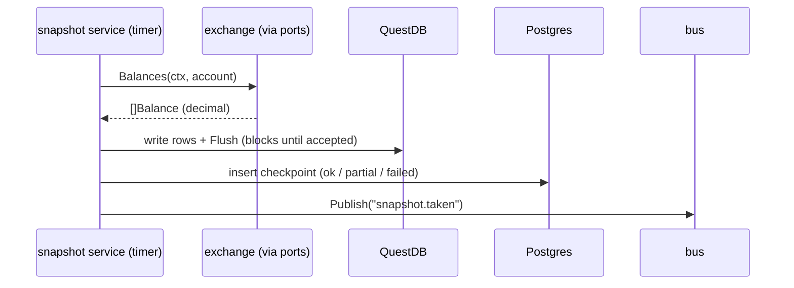

# Spec: Account watch (foundation + read-only exchange)

**Status:** delivered 2026-07-02; live verification completed later with Coinbase credentials.

## What this milestone is, and why the first milestone refuses to trade

Account watch builds a daemon (`deltad`) that does one modest thing end to end: on a timer, ask each configured exchange for account balances, write them into the time-series database, and durably record that this happened. No orders, no trading, nothing that can lose money.

The modesty is a strategy. A trading system's first real order will depend on configuration loading, logging, database migrations, query generation, integration testing, metrics, health checks, graceful shutdown, exchange connectivity, and a resilience stack, all working at once. If those are built alongside the first order, every infrastructure bug costs money while you debug it. This milestone forces every one of those pieces into existence against a problem where the worst possible bug is a wrong number on a chart. By the time manual trading puts money on the line, the skeleton has been running in production conditions for weeks.

The second purpose is subtler: this milestone locks the seams that manual trading and the grid bots will need, before any pressure exists to cut corners on them. The trading interfaces were designed and compiled here with no implementation behind them, the domain layer was kept free of infrastructure, and the two-database split was established while the data was still harmless.

## One snapshot tick, end to end

Everything the daemon does, in one picture:



The ordering of the last three steps is a rule, not a habit, and it teaches the pattern this codebase uses everywhere for "flaky store plus truth store":

1. QuestDB's ingestion protocol is at-least-once and fire-and-forget, so the only way to know data arrived is to `Flush` and wait for acceptance.
2. The Postgres checkpoint is written **after** the flush succeeds, so a checkpoint row is proof the data is in QuestDB. Write it before, and a crash between the two produces a checkpoint pointing at data that does not exist, which is a lie in the truth store. Written after, the worst crash outcome is data without a checkpoint: a visible gap, repairable, honest.
3. The bus event goes out last because it is only a hint (ADR-0005: at-most-once, droppable); anything that must be reliable is already in a database by the time it is published.

The same shape returns in manual trading as the transactional outbox (ADR-0008): durable record first, notification derived from it.

## Package layout

```
cmd/daemon/                 # main: builds and runs the fx app
internal/app/               # fx composition root: what gets constructed, in which lifecycle order
internal/config/            # koanf v2: config.yaml + DELTA__ env overrides, typed Config, Validate()
internal/log/               # zerolog construction; exports the Logger alias (sole zerolog import point)
clockwork (dependency)      # maintained real clock + deterministic fake time
internal/telemetry/         # prometheus registry; HTTP: /metrics /healthz /readyz
internal/bus/               # in-process NATS-shaped event bus (ADR-0005)
internal/domain/money/      # canonical Currency; owning records keep decimal quantities and currency separately  [pure]
internal/domain/instrument/ # VenueID, Instrument{Base,Quote,VenueSymbol,Rules}                    [pure]
internal/domain/account/    # AccountType, AccountRef, Balance, Snapshot                           [pure]
internal/domain/marketdata/ # Ticker                                                               [pure]
internal/snapshot/          # UUID-backed checkpoint model, outside the pure domain
internal/events/            # neutral internal subjects, payloads, and outbox delivery rows
internal/ports/             # consumer-sized venue, trading, and persistence behavior interfaces
internal/adapters/gct/      # GCT lifecycle, port implementations, and source-verified capability support
internal/adapters/postgres/ # pgxpool, sqlc queries, snapshot recorder/reader, migrations/ (goose)
internal/adapters/questdb/  # ILP writer implementing separate balance and ticker series capabilities
internal/venue/             # deterministic capability catalog + one shared request gate per venue
internal/service/snapshot/  # one poller per catalog-provided venue+account+reader target
```

Why these packages and not a flatter layout: each directory is one of the seams described above. `domain` can be tested with zero setup because it imports nothing heavy. `ports` is the line adapters cannot cross upward. `adapters` can each be replaced without touching a service. `app` builds one sorted catalog entry per canonical venue, and services consume catalog-owned capabilities instead of reconstructing venue views. Snapshot targets carry their account reader directly, so a target derived from the catalog never performs a second registry lookup. `app` remains the single place that knows how everything connects, so "what runs in this daemon" has exactly one answer.

Three structural rules a contributor must know, all linter-enforced where possible:

- **Domain purity.** Production code under `internal/domain/` imports the standard library, sibling domain packages, and shopspring/decimal. Nothing else, ever. The business vocabulary (money, instruments, balances) stays free of infrastructure, so it is trivially testable and survives any adapter swap. Test files may add test-only dependencies.
- **Everything external sits behind `internal/ports`.** Services never import an adapter. Ports express the smallest behavior each consumer uses and refer to models owned by their domain or neutral application capability rather than owning universal DTOs (ADR-0003 and ADR-0009).
- **The trading seam was locked early.** `OrderPlacer` and `PrivateStreamer` were compiled here with no implementor, and `ClientOrderID` was declared as ours (generated locally, sent to the venue, used as the idempotency key) before any order code existed. Interfaces are cheapest to get right when nothing depends on them yet; by the time manual trading arrived, five packages already compiled against these signatures.

Two domain details worth calling out because they prevent real bugs:

- Monetary quantities use decimal rather than float64, and their owning records carry currency separately. This keeps accounting exact without claiming active cross-currency arithmetic.
- `instrument.Instrument` separates our canonical view (Base, Quote) from the venue's spelling (`VenueSymbol`, since one venue says `BTCUSDT` and another `BTC-USD`), so venue quirks stay at the edge.

## Resilience: what happens when a venue misbehaves

Exchanges rate-limit, time out, return 5xx, and go down for maintenance, routinely, not exceptionally. Every synchronous venue request passes through three layers, each with one job (the full reasoning and the layer-ordering argument live in ADR-0003 and ADR-0010):

```text
service retry (backoff/v5)
  -> shared circuit breaker per venue (gobreaker/v2)
    -> shared rate limiter per venue (x/time/rate)
      -> gct adapter -> venue
```

Account, market-data, and order capabilities remain distinct, but their thin wrappers use the same limiter and breaker for a venue. An absent capability stays absent instead of appearing as a method that fails at call time. Private streams remain outside this request gate because a long-lived session does not have request semantics; reconciliation remains the correctness path for events missed by a stream.

Two snapshot-specific calibrations show how the layers interact with the snapshot loop:

- The retry's total elapsed time is capped below the poll interval. Without the cap, a slow venue makes tick N's retries collide with tick N+1, and load on a struggling venue doubles exactly when it should halve.
- Authentication errors are marked permanent: a bad API key fails once with a clear log line instead of being retried forever. Retrying cannot fix a wrong key, and hammering a venue with bad credentials is how keys get banned.

The failure policy distinguishes two classes, and the distinction matters operationally:

| Failure class | Example | Response | Why |
|---|---|---|---|
| venue trouble | timeout, 5xx, rate-limit, maintenance | log, count, let the breaker act, try next tick | normal weather; the daemon's job is to outlast it |
| infrastructure loss | Postgres or QuestDB unreachable | escalate to `fx.Shutdowner`, exit non-zero, let the supervisor restart | the daemon cannot do its job at all; a fast visible death beats a half-alive process silently doing nothing |

Partial truth is recorded honestly: a tick where two venues succeeded and one failed writes a `partial` checkpoint carrying the error, so gaps are queryable afterwards instead of invisible.

## Metrics: built for the alerts, not the dashboard

| Metric | The alert it enables |
|---|---|
| `snapshot_last_success_timestamp_seconds{venue}` | "now minus value > 3 intervals". This one alert catches every failure mode, including ones nobody predicted, because it observes the absence of success rather than enumerating causes of failure |
| `snapshot_errors_total{venue}` | error-rate context when the staleness alert fires |
| `snapshot_duration_seconds{venue}` | ticks approaching the interval mean the schedule is about to slip |
| `bus_dropped_total` | a slow bus subscriber is losing events; visible instead of silent |

The staleness-gauge pattern (export the last success time, alert on its age) is the house standard; the reconciliation loop in manual trading adopts it unchanged.

## Storage

| Store | Object | Contents |
|---|---|---|
| Postgres | `snapshot_checkpoints` | id uuid PK, venue, account_type, taken_at, balance_count, status (`ok`/`partial`/`failed`), error, created_at |
| QuestDB | `balances` (auto-created by ILP) | symbols: venue, account, currency; doubles: total, free, locked; timestamp = taken_at |
| QuestDB | `tickers` (auto-created by ILP) | symbols: venue, symbol; doubles: bid, ask, last, bid_size, ask_size |

Migrations are goose SQL files embedded in the binary via `embed.FS` and applied at startup, so a deployed binary and its schema cannot drift apart. Queries are sqlc-generated (ADR-0002 explains why generated-from-SQL beats an ORM here). Money is `numeric` in Postgres and decimal in Go; conversion to float64 happens only on the QuestDB edge, because that store is analytics, never accounting truth (ADR-0004).

One choice that looks odd until manual trading: Postgres holds almost nothing here, a single checkpoint table. That single table still forced the entire migrations + sqlc + testcontainers pipeline to exist and be exercised in CI for weeks before the orders, fills, and ledger tables arrived with real stakes.

## Verification

1. `make ci` green locally and in GitHub Actions: fmt-check, lint, vuln, test-race, tidy-check. The race detector and test shuffling are always on (ADR-0002 explains what each catches).
2. `make test-integration` green: testcontainers boots real Postgres and QuestDB; tests cover migration application, checkpoint round-trips, and ILP write round-trips against the actual engines.
3. Live: `make compose-up && make run` with venue keys configured, then watch `balances` rows grow in QuestDB, `ok` checkpoints appear in Postgres, `/readyz` return 200, and a SIGTERM produce a clean, ordered shutdown with no goroutine leaks.
