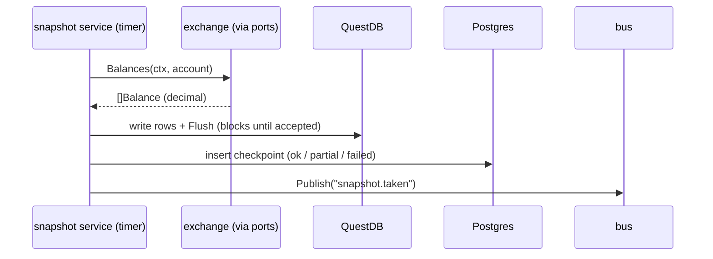

# Spec: M1: Foundation + read-only exchange

**Status:** delivered 2026-07-02, except live-key verification (running with real venue credentials and confirming balances flow into QuestDB), which needed API keys in env. Completed later with coinbase credentials.

## What M1 is and why it comes first

M1 builds a daemon (`deltad`) that does one modest thing end to end: every minute, ask each configured exchange for account balances, write them into the time-series database, and durably record that this happened. No trading, no orders, nothing that can lose money.

The modesty is the point. This milestone exists to force every piece of engineering infrastructure into existence against a problem that is safe to get wrong: configuration loading, structured logging, database migrations, generated SQL, integration tests against real databases in CI, metrics, health endpoints, graceful shutdown, the exchange adapter, and the resilience stack. When M2 arrives with orders and money on the line, all of that is already proven. Reading this spec teaches you the skeleton every later milestone hangs from.

## How the daemon fits together

One process, assembled by the fx dependency-injection container from the packages below. The flow of a single snapshot tick:



The ordering of the last three steps encodes ADR-0004: the Postgres checkpoint is written only after QuestDB confirmed the data, so a checkpoint is proof the data arrived, and the bus event is a non-guaranteed hint published last.

## Package layout

```
cmd/deltad/                 # main: builds and runs the fx app
internal/app/               # fx composition root: what gets constructed and in which lifecycle order
internal/config/            # koanf v2: config.yaml + DELTA__ env overrides, typed Config, Validate()
internal/log/               # zerolog construction; exports the Logger alias (sole zerolog import point)
internal/clock/ (+clocktest)# Clock interface + deterministic fake, so time-dependent code is testable
internal/telemetry/         # prometheus registry; HTTP: /metrics /healthz /readyz
internal/bus/               # in-process NATS-shaped event bus (ADR-0005)
internal/domain/money/      # Currency, Amount (a decimal that refuses cross-currency arithmetic)  [pure]
internal/domain/instrument/ # VenueID, Instrument{Base,Quote,VenueSymbol,Rules}                    [pure]
internal/domain/account/    # AccountType, AccountRef, Balance, Snapshot                           [pure]
internal/domain/marketdata/ # Ticker                                                               [pure]
internal/ports/             # the hexagon boundary: exchange ports + trading ports (M2 seam) + store ports
internal/adapters/gct/      # GCT engine lifecycle + port implementations; convert.go is the sole contact point
internal/adapters/postgres/ # pgxpool, sqlc-generated queries, CheckpointStore, migrations/ (goose)
internal/adapters/questdb/  # ILP LineSender wrapper implementing SeriesWriter
internal/exchange/          # Registry(VenueID -> Exchange) + rate-limit and breaker decorators
internal/service/snapshot/  # the snapshot poller (errgroup, one goroutine per venue+account)
```

Two structural rules a contributor must know:

- **Domain purity.** Packages under `internal/domain/` import the standard library, sibling domain packages, and shopspring/decimal. Nothing else. This keeps the business vocabulary free of infrastructure, so it can be tested with zero setup and reused under any adapter. Test files may use test-only dependencies; production code may not.
- **Everything external sits behind `internal/ports`.** Services never import an adapter. The trading ports (`OrderPlacer`, `PrivateStreamer`) were compiled in M1 with no implementation on purpose: agreeing on the interface early locked the M2 seam, and the type `ClientOrderID` was declared ours (generated by us, sent to the venue, used as the idempotency key) before any order code existed.

## Key behaviors

- **Resilience layering** (explained in ADR-0003), from caller to venue: service retry (backoff/v5, with the total retry time capped below the poll interval so retries never pile into the next tick, and auth errors marked permanent so a bad key fails once instead of hammering), then a per-venue circuit breaker (gobreaker/v2), then a rate limiter (`rate.Limiter.Wait`), then the GCT adapter.
- **Failure policy** distinguishes two classes. A venue failing (timeout, 5xx, rate-limit) is normal weather: log it, count it, let the breaker do its job, try again next tick. Infrastructure failing (Postgres or QuestDB unreachable) means the daemon cannot do its job at all: escalate to `fx.Shutdowner`, exit non-zero, and let the supervisor (compose, systemd) restart the process. Failing fast beats limping in a half-broken state.
- **Checkpoints record partial truth honestly**: a tick where some venues succeeded and some failed writes a `partial` checkpoint with the error, so gaps are queryable instead of invisible.
- **Metrics** are chosen for alertability, not decoration: `snapshot_last_success_timestamp_seconds{venue}` is a gauge of the last success time, so the alert "now minus last success > 3 intervals" catches every failure mode including the ones nobody predicted, without any error-specific rule. `snapshot_duration_seconds`, `snapshot_errors_total`, and `bus_dropped_total` cover the rest.

## Storage

| Store | Object | Contents |
|---|---|---|
| Postgres | `snapshot_checkpoints` | id uuid PK, venue, account_type, taken_at, balance_count, status (`ok`/`partial`/`failed`), error, created_at |
| QuestDB | `balances` (auto-created by ILP) | symbols: venue, account, currency; doubles: total, free, locked; timestamp = taken_at |
| QuestDB | `tickers` (auto-created by ILP) | symbols: venue, symbol; doubles: bid, ask, last, bid_size, ask_size |

Migrations are goose SQL files embedded in the binary and applied at startup; queries are sqlc-generated; money is `numeric` in Postgres and decimal in Go, converted to float64 only on the QuestDB edge (ADR-0002, ADR-0004).

## Verification

1. `make ci` green locally and in GitHub Actions (fmt-check, lint, vuln, test-race, tidy-check).
2. `make test-integration` green: testcontainers boots real Postgres and QuestDB; tests cover migration application, checkpoint round-trips, and ILP write round-trips.
3. Live: `make compose-up && make run` with venue keys configured, then watch `balances` rows grow in QuestDB, `ok` checkpoints appear in Postgres, `/readyz` return 200, and a SIGTERM produce a clean, ordered shutdown.
