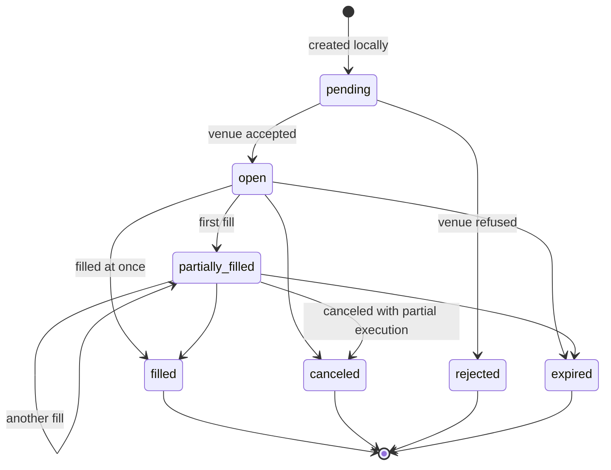
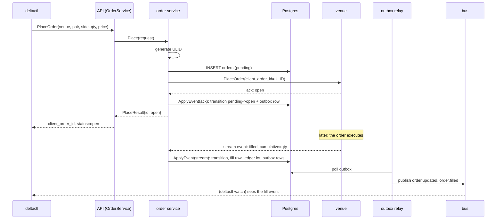

# Spec: M2: Order management

**Status:** accepted 2026-07-05, implementation in progress. This document is normative: implementations follow it, and changes to behavior change this file in the same PR.

## What an order management system is, and why it is the hard part

When you place an order on an exchange, you start a conversation with a machine you do not control, over a network that loses messages, about money. The exchange executes your order in its own time, tells you about it through several channels at once (the immediate API response, a websocket stream, and whatever you see when you ask again later), and those channels disagree with each other routinely: events arrive late, out of order, duplicated, or not at all.

An order management system (OMS) is the component that turns that unreliable conversation into reliable local facts: what orders exist, what state each is in, how much of each has executed, and at what prices. Everything else in a trading platform builds on those facts. If the OMS double-counts one fill or loses one, every profit number downstream is fiction.

Before reading the design, it helps to see exactly what goes wrong with the naive implementation, because every mechanism in this spec exists to kill one of these failure modes:

| # | Naive behavior | What goes wrong | The mechanism that prevents it here |
|---|---|---|---|
| 1 | submit an order; on timeout, submit again | the first submit actually succeeded; you now have two live orders and double the position you wanted | client-generated idempotency keys (ULIDs), retried with the same key |
| 2 | apply events in arrival order | a stale `open` event arrives after `filled` and reopens a finished order | monotonic rank guard |
| 3 | store per-event fill amounts | a duplicated fill event adds its quantity twice | events carry cumulative quantity; deltas are computed locally |
| 4 | commit the fill, then notify other components | crash between the two loses the notification forever | transactional outbox (ADR-0008) |
| 5 | trust the stream to deliver everything | a dropped websocket silently loses events; local state diverges from the venue forever | the reconciliation loop |
| 6 | track balances instead of positions | you know you own 0.5 BTC but not what you paid; profit is unknowable per bot | the lot ledger |

M2 builds, in one milestone: the order state machine (2, 3), ID discipline (1), the outbox (4), reconciliation (5), and the ledger (6), plus the typed API through which orders enter. Orders enter the system only through the control plane, `OrderService` RPCs and their `deltactl order` commands (ADR-0007); trading bots become a second caller in M3.

The one idea underneath all of it: **the exchange is the authority on what happened, and our job is to converge on its view without ever losing or double-counting a fact.** Never fight the venue about execution facts; never trust any single delivery channel to be complete.

## Package layout

Additions to the M1 tree:

```
internal/id/                # ULID generation (oklog/ulid/v2, crypto/rand entropy)
internal/domain/order/      # state machine: Transition(current, event) (decision, error)  [pure]
internal/domain/ledger/     # Lot, Closure, LotSelector interface, FIFO selector           [pure]
internal/service/order/     # place/cancel/apply-event orchestration
internal/service/reconcile/ # periodic venue-vs-local diff loop
internal/service/outbox/    # outbox relay: poll, then bus.Publish
internal/adapters/gct/      # gains OrderPlacer + PrivateStreamer implementations
internal/adapters/postgres/ # gains OrderStore, OutboxStore, ledger posting
proto/control/v1/           # gains orders.proto (OrderService) + new Event oneof arms
```

Domain packages stay pure (ADR-0002): `internal/id` owns the ULID dependency; domain code treats IDs as opaque strings.

## The order state machine

### States and their lifecycle

An order moves through seven states:



| State | Meaning | Terminal |
|---|---|---|
| `pending` | we created it locally; the venue may not know it yet | no |
| `open` | the venue accepted it; nothing executed yet | no |
| `partially_filled` | some quantity executed | no |
| `filled` | fully executed | yes |
| `canceled` | canceled before completion (possibly after partial execution) | yes |
| `rejected` | the venue refused it | yes |
| `expired` | the venue timed it out | yes |

Terminal means no further state change is possible. Note what is absent from the diagram: there are no backward arrows. That is not an accident of drawing; it is the core invariant, enforced by the first of two mechanisms.

### Mechanism 1: the rank guard

Each state has a rank: `pending`(0) < `open`(1) < `partially_filled`(2) < terminal(3). An order's rank never decreases. When an event arrives whose status has a lower rank than the stored status, the status is stale news from the past and is dropped.

Why this is necessary: events describing the same order race each other through different channels. The synchronous response to `PlaceOrder` (the "ack"), the websocket stream, and reconciliation all report states, with no ordering guarantee between them. Without the guard, failure mode 2 from the table above is routine: the slow ack saying `open` lands after the stream already delivered `filled`, and the order reopens.

### Mechanism 2: cumulative quantities

`order.Event` carries the venue's **cumulative** filled quantity, never a per-fill amount. The fill delta is computed locally: event cumulative minus stored cumulative. Positive delta: that much newly executed, record it. Zero delta: nothing new, this is a duplicate or a repeat. This kills failure mode 3: a duplicated event computes a delta of zero the second time, mechanically, with no dedup bookkeeping.

Events also carry per-fill facts where the venue provides them (`VenueFillID`, price, `Fee`, `FeeCurrency`), used for exact fill deduplication in storage and for ledger cost basis.

### Watch it work: five events, out of order

An order for 1.0 BTC. The venue emitted events in the order 1, 2, 3, 4, 5, but they arrive as shown. Stored state starts as (`pending`, filled 0).

| Arrives | Event (status, cumulative) | Machine decision | Stored state after | Why |
|---|---|---|---|---|
| 1st | ack: `open`, 0 | apply | `open`, 0 | rank 1 > 0 |
| 2nd | stream: `filled`, 1.0 | apply, fill delta 1.0 | `filled`, 1.0 | rank 3 > 1; delta = 1.0 − 0 |
| 3rd | stream (late): `partially_filled`, 0.4 | drop status, extract nothing | `filled`, 1.0 | rank regresses 2 < 3; cumulative 0.4 < 1.0, no new quantity |
| 4th | stream (duplicate): `filled`, 1.0 | drop as duplicate | `filled`, 1.0 | same rank, delta = 0 |
| 5th | reconcile: `filled`, 1.0 | drop (post-terminal) | `filled`, 1.0 | already terminal, nothing new |

Five deliveries, three of them junk, and the state is exactly right without any of the junk being an error. That is the property the whole design buys: **apply is order-independent**. Any arrival order of the same events converges to the same final state (this is verified by a property-based test that generates thousands of random event permutations and asserts convergence).

One more arrival worth seeing, because it is subtle. Suppose the 3rd arrival had been `partially_filled` with cumulative **1.2** on an order where we stored 1.0 (the venue knows about execution we missed). The status still drops (rank regression), but the quantity is an execution fact we would otherwise lose, so the delta of 0.2 is extracted and recorded anyway. Dropping a status and extracting a fill from the same event is normal here.

### The full decision table

Event status horizontally, stored status vertically:

| stored \ event | pending | open | partially_filled | filled | canceled | rejected | expired |
|---|---|---|---|---|---|---|---|
| pending | drop | apply | apply | apply | apply | apply | apply |
| open | drop | drop* | apply | apply | apply | apply | apply |
| partially_filled | drop | drop* | apply* | apply | apply | apply | apply |
| terminal | drop | drop | drop* | drop* | drop* | drop* | drop* |

`*` = fills still extracted when the event's cumulative exceeds the stored value, per the mechanism above. Post-terminal `canceled`/`rejected`/`expired` events get the asterisk too, because venues report cancel-after-partial-fill with the final cumulative attached. `pending` events never apply and never carry fills: a fill cannot exist before the venue has accepted the order, so a pending event claiming one is malformed.

The table is total: every (stored, event) pair is either an apply cell or covered by the drop rule (rank-regressing, or same-rank with no new cumulative fill). Drops are never silent; they are counted in `order_events_dropped_total{venue,reason}` with reasons `stale`, `duplicate`, `terminal`. An exhaustive unit test enumerates every pair in this table.

### The contradictory-event rule

One case needs its own rule: an event whose status advances the rank but whose cumulative quantity is *lower* than stored. Example, and it is a real one several venues produce: we recorded a partial fill of 0.01, then the venue sends `canceled` with executed quantity 0, because its cancel confirmations do not echo execution.

The event contradicts itself as far as we are concerned: the status is news, the quantity is a regression. The rule: **the status applies (venue wins on state), the fill regression is rejected (never un-fill), and the rejection is counted**: `order_events_dropped_total{reason="negative_fill_delta"}` on the ack/stream path, `reconcile_diffs_total{kind="fill_anomaly"}` when reconciliation discovers it.

Why not drop the whole contradictory event? Because then the order never terminates: the cancel keeps arriving (stream retries, every reconcile pass), keeps being dropped, and the order is stuck non-terminal forever while its money sits in limbo. This exact bug existed, was found by the permutation property test on its first run, and the fix is this rule. Same-or-lower-rank events with regressed quantities are just stale traffic and drop normally.

### What applying an event actually writes

Apply is idempotent and runs in one Postgres transaction with `SELECT ... FOR UPDATE` on the order row (the row lock serializes concurrent events for the same order):

| Step | Table | What and why |
|---|---|---|
| 1 | `fills` | if fill delta > 0, insert a fill row (delta quantity, price, fee, venue fill ID). Deduplicated by `venue_fill_id` where the venue provides one, as a second line of defense behind the cumulative-delta math |
| 2 | `order_transitions` | if the status changed, append a transition row: from, to, cumulative quantity, source, timestamps, with `seq` incrementing per order. This is the audit trail: when local and venue state ever disagree, this log shows exactly which events arrived, from which channel, in what order, and what each one did |
| 3 | `orders` | update the current-state row (status, cumulative filled quantity, average fill price) |
| 4 | `lots` / `lot_closures` / `unmatched_sells` | ledger postings (section below) |
| 5 | `outbox` | insert `order.updated` / `order.filled` event rows (ADR-0008) |

One commit makes all five visible together; a crash anywhere rolls back all five. There is no state in which a fill exists without its transition, its ledger posting, or its outbox event.

Cancel is an intent, not a state: `CancelOrder` stamps `cancel_requested_at` on the order and asks the venue; the actual `canceled` transition arrives later through the stream or reconciliation like any other venue event. Recording "canceled" at request time would be recording something the venue has not confirmed, and venues do refuse cancels (the order may have filled first).

## Client order IDs

### What a ULID is and why it fits

Every order gets an ID generated by us before anything touches the network: a ULID. A ULID is a 128-bit identifier rendered as 26 characters, built from two parts:

```
 01JG3AC9GV  X0P5S6K8ZT2M4Q7R
 |---------| |---------------|
  timestamp    randomness
  48 bits      80 bits
  (millisecond (crypto/rand)
   precision)
```

The properties that matter here: it is globally unique without coordination (80 random bits), and it sorts lexicographically by creation time (timestamp prefix), so ID order is time order in indexes and logs. UUIDs give uniqueness but sort randomly; sequential integers sort nicely but need a coordinator. ULID gives both for free.

### The idempotency discipline

`orders.client_order_id` is the local primary key, and the same ID travels to the venue with the order, where exchanges treat it as an idempotency key: a second submission with the same client order ID does not create a second order.

The pending row is inserted **before** `PlaceOrder` is called, and the ordering is the point. Compare the two possible crash-mid-submit outcomes:

| Insert first (chosen) | Submit first |
|---|---|
| crash leaves a local `pending` order that may not exist on the venue; reconciliation resolves it (adopt or mark `submit-lost`) | crash leaves a live venue order that no local record knows about: untracked money |

A record for money that may not exist is recoverable; money with no record is a search party.

Submit failure handling, walked through:

1. `PlaceOrder` times out. Did the venue get it? Unknowable: the request may have died on the way there (no order exists) or the response on the way back (an order exists). This is failure mode 1 from the intro table.
2. Retry **with the same ULID**, never a fresh one. If the first submit died en route, the retry places the order: correct. If the first submit landed, the venue answers "duplicate client order ID": also correct, and that error is good news, treated as success.
3. The duplicate-error response carries no venue order ID, so the order stays `pending` locally until the next stream event or reconcile pass supplies one, matched on the client order ID the venue echoes back on every event.
4. All retries exhausted and still no answer: the order stays `pending` and the caller is told the submit is unsettled. Reconciliation takes over: it either finds the order on the venue and adopts it, or, after a grace window of twice the reconcile interval, marks it `rejected` with reason `submit-lost`. The grace window exists because a submit can succeed on the venue after our last retry gave up waiting.

At the RPC layer, a supplied client order ID is a request idempotency key with teeth: retrying with the same ID and the same order parameters returns the existing order's current state; reusing an ID with *different* parameters is rejected outright, because silently submitting an order that disagrees with the stored row under the same key would corrupt the meaning of the key.

## The life of an order, end to end

Everything above in one picture. `deltactl order place` on a quiet day:



## Private order-event streaming

The GCT adapter implements `ports.PrivateStreamer`: it owns the authenticated websocket lifecycle including reconnects, and publishes `stream.reconnected` on the bus after every reconnect so reconciliation can immediately close whatever gap the disconnection opened. Stream events feed `ApplyEvent` with `source=stream`; the synchronous PlaceOrder/CancelOrder response feeds it with `source=ack`. The two race freely; the rank guard and cumulative quantities make the race harmless, as shown above.

## Reconciliation

### Why streams are not enough

A websocket that drops for forty seconds loses every event the venue emitted in those forty seconds, and the venue will not resend them. The daemon restarting loses whatever was in flight. Failure mode 5: without a backstop, local state diverges from venue state and stays diverged. Reconciliation is the backstop: a loop that periodically asks the venue "what do you think is true" and repairs the difference. The design goal is that the stream is a latency optimization, and the system would eventually converge on reconciliation alone.

The port surface it needs: `OpenOrders(ctx)` venue-wide, deliberately unfiltered by symbol, because the loop must see everything including orders it does not expect; and `GetOrder(ctx, ref)` for point lookups. The loop runs per venue every 30s (configurable) and immediately on `stream.reconnected`.

### A concrete repair, step by step

The websocket died at the wrong moment. Local state: order `01JG3...` is `partially_filled`, cumulative 0.4. What actually happened while the socket was down: the order finished filling. The next reconcile pass:

1. `OpenOrders(coinbase)` returns the venue's open orders. `01JG3...` is not among them (it is filled, hence no longer open).
2. Locally the order is non-terminal but absent from the venue's open set. Something ended it; find out what: `GetOrder(01JG3...)`.
3. The venue answers: `filled`, cumulative 1.0.
4. Apply that as an event with `source=reconcile`: the machine computes fill delta 0.6, records the fill, transitions to `filled`, posts the ledger, writes the outbox rows. The same pipeline as a stream event, which is the point: reconciliation has no special write path that could disagree with the normal one.

The transition row's `source=reconcile` marks the repair forever: anyone auditing later can see this fact arrived via reconciliation, not the stream.

### The full diff table

The governing rule: the venue wins on execution facts.

| Situation the pass finds | Action | Why |
|---|---|---|
| local non-terminal order absent from venue open orders | `GetOrder`, apply its terminal state | the walk above |
| local pending order found on the venue | adopt it: apply the venue's state, capturing the venue order ID | a submit we thought lost actually landed |
| local pending order absent, grace window (2× interval) expired, venue positively answers "no such order" | mark `rejected`, reason `submit-lost` | the submit really was lost; only a positive not-found triggers this, never a generic error, so a venue outage cannot mass-reject pending orders |
| cumulative quantity drift | apply the venue value through the normal fill-delta path | execution facts |
| venue order unknown locally | **not** adopted; publish `reconcile.orphan`, raise a gauge | an unknown live order means a foreign order on a shared account or lost local state; both need a human, not an auto-import that guesses |

Reconcile-sourced fills carry no `venue_fill_id` or fee and are priced at the venue's average fill price: an accepted approximation, preferred over losing the quantity entirely, and identifiable forever via `source=reconcile`.

## The ledger

### From fills to inventory

A venue balance says you own 0.5 BTC; it cannot say what you paid for it, so it cannot support per-bot profit. The ledger tracks inventory as **lots**: each buy fill opens a lot (quantity, cost price); each sell fill closes lots. Which lots a sell closes is a policy behind a one-method interface:

```go
type LotSelector interface {
    Select(open []Lot, sellQty decimal.Decimal) Allocation
}
```

M2 ships FIFO (oldest first, the standard accounting default). The interface exists for M3: a grid bot's sell should close the lot bought one grid level below, which is just another selector, and nothing else changes. Worked example:

| Event | Qty | Price | Ledger action |
|---|---|---|---|
| buy fill | 0.30 | 50,000 | opens Lot A (0.30 @ 50,000) |
| buy fill | 0.20 | 61,000 | opens Lot B (0.20 @ 61,000) |
| sell fill | 0.40 | 63,000 | closes Lot A fully, Lot B partially (0.10) |

Realized profit is now exact: 0.30 × (63,000 − 50,000) + 0.10 × (63,000 − 61,000). No averaging, no estimation; every number traces to specific fills.

### Oversell: record and warn, never reject

A sell fill can exceed open inventory (stream gap, manual trade outside the system, lost state). Three possible policies:

1. Reject the fill: impossible. The venue already executed it; a venue-reported fill is a historical fact.
2. Close what matches, ignore the rest: hides the discrepancy forever.
3. Close what matches, record the remainder in `unmatched_sells`, publish `ledger.unmatched_sell`, count it: the books stay factual and the anomaly is visible.

Policy 3 is the rule. Unmatched remainders are never retro-matched when later buys arrive, because an unmatched sell is evidence that something upstream went wrong, and auto-healing would erase the evidence. M3's reservations prevent oversell before submission; this is the fallback for when reality disagrees.

### Concurrency and ordering

Ledger posting happens inside the same `ApplyEvent` transaction as the fill, serialized by a transaction-scoped advisory lock per `(bot_id, venue, base, quote)` inventory key. The lock exists because row locks cannot lock rows that do not exist yet: without it, a sell processed while a buy for the same inventory is uncommitted sees zero lots and records a false oversell, which no-retro-matching then preserves forever. (The full failure schedule and the fix are walked through in the PR #20 description.)

A consequence stated here so nobody discovers it as a surprise: matching order is the serial order in which transactions acquire the inventory lock, with FIFO by `(opened_at, id)` among lots already posted. "FIFO as if all events had arrived in real-world order" is not promised, because a system that receives events out of order and refuses to revisit past matches cannot deliver it; claiming otherwise would be documentation lying about the code.

`Request` carries `BotID` from day one; RPC-placed orders use the reserved bot ID `manual`.

### Fees, honestly

M2 lot cost basis is execution-price-only. Fees are recorded on fills but not allocated to lots, because fees come in three shapes with different inventory meanings: a quote-currency fee raises your effective cost, a base-currency fee reduces the inventory you actually received, and a third-currency fee (exchange tokens) needs an exchange rate to mean anything. A single cost-price column cannot express all three without a convention, and a half-convention silently wrong for one fee shape is worse than a documented absence. Fee-aware inventory and PnL land in M3. Until then, every fee is preserved on its fill row; nothing is lost, only unallocated.

## Outbox

Order events reach the bus only through the outbox; services never `bus.Publish` them directly. The reason (the dual-write problem: a crash between a database commit and a bus publish loses the event forever) and the full mechanics (the relay, its query, the failure-point analysis) are the subject of [ADR-0008](../adr/0008-transactional-outbox.md), which is worth reading in full. Summary of the contract: delivery from commit to bus is at-least-once, the bus stays at-most-once to subscribers, and anything that must be exact reads Postgres.

## Metrics

Chosen for the alerts they enable, not for decoration:

| Metric | The question it answers | The alert you would build |
|---|---|---|
| `order_events_dropped_total{venue,reason}` | how much stale/duplicate/anomalous venue traffic | rate spike on `negative_fill_delta` = venue sending contradictory data |
| `outbox_unpublished_rows`, `outbox_oldest_unpublished_age_seconds` | is the relay draining | age > a few poll intervals = relay stuck |
| `outbox_published_total` | relay throughput | none; context for the others |
| `reconcile_diffs_total{venue,kind}` | how often reconciliation repairs divergence, by kind | sustained `fill_anomaly` or `unmatched_sell` rate = investigate the venue feed |
| `reconcile_duration_seconds{venue}` | reconcile pass cost | approaching the interval = passes overlapping |
| `reconcile_last_success_timestamp_seconds{venue}` | is reconciliation alive | now − value > 3 intervals, same pattern as M1's snapshot staleness alert |
| `ledger_unmatched_sells_total{venue}` | oversells on the stream/ack path | any increase = look at the `unmatched_sells` table |

## Storage

Migrations `0002_orders`, `0003_outbox`, `0004_ledger` (goose, embedded, brand-neutral names). All money columns are `numeric` (ADR-0002).

| Table | Purpose | Key columns and constraints |
|---|---|---|
| `orders` | current state, one row per order | `client_order_id` text PK; venue, base, quote, venue_symbol, side, type, price, qty, filled_qty, avg_fill_price, status, venue_order_id, bot_id, cancel_requested_at, reason, created_at, updated_at. Partial `UNIQUE(venue, venue_order_id)` where set; indexes `(venue, status)` and `(bot_id, created_at DESC)` |
| `order_transitions` | append-only audit trail | identity PK, FK to orders, `seq` with `UNIQUE(client_order_id, seq)`, from/to status, cumulative filled_qty, source `CHECK (source IN ('local','stream','ack','reconcile'))`, reason, occurred_at, recorded_at |
| `fills` | one row per fill delta | identity PK, order + transition FKs, qty (delta), price, fee, fee_currency, venue_fill_id (partial unique), occurred_at |
| `outbox` | ADR-0008 event queue | identity PK, subject, payload jsonb, created_at, published_at NULL; partial index on unpublished rows |
| `lots` | inventory | ULID text PK, bot_id, venue, base, quote, qty, remaining_qty, cost_price, `opened_by_fill_id` bigint unique FK, status, opened_at, closed_at; CHECK constraints couple status, remaining_qty and closed_at so invalid lot states are unrepresentable |
| `lot_closures` | which lot a sell consumed | identity PK, lot FK, sell fill FK, qty, price, closed_at, `UNIQUE(lot_id, sell_fill_id)` |
| `unmatched_sells` | oversell remainders | `sell_fill_id` bigint PK/FK, bot_id, venue, base, quote, qty, occurred_at |

QuestDB gains a `fills` series (symbols: venue, symbol, side, bot; doubles: qty, price, fee). Analytics only, per ADR-0004.

## Control plane

- `proto/control/v1/orders.proto`: `OrderService` with `PlaceOrder`, `CancelOrder`, `ListOrders`. Validation lives in the schema as protovalidate rules and runs in an interceptor before any handler. Decimals cross the wire as strings, never floats (ADR-0007 explains why protobuf's `double` is disqualified for money). The wire package stays `control.v1`, brand-neutral.
- The existing `Event` oneof gains append-only arms: `order_updated = 11`, `order_filled = 12`, `reconcile_diff = 13`. Arm numbers are never reused.
- `deltactl order place|cancel|list` speak these RPCs, and they are the only way to place an order until M3 (ADR-0007: no client bypasses the API).

## Verification

1. Exhaustive transition-table unit test: every (stored, event) status pair asserts the decision table above. Property-based tests (thousands of generated event sequences) assert the invariants the design claims: rank never decreases, cumulative quantity never decreases, applying an event twice equals applying it once, and permutations of the same events converge to the same state. The permutation property found a real bug on its first run (the contradictory-event rule above); that is the class of guarantee these tests exist for.
2. `make test-integration` (real Postgres in containers): ApplyEvent idempotency (same event twice produces one transition and one fill), out-of-order convergence (fill before ack reaches the same final state), outbox round-trip ordering, reconcile against a fake venue (terminal adoption, drift, orphan), FIFO lot math including both oversell shapes, and the ledger concurrency races (buy vs oversized sell, sell vs sell, on one inventory key).
3. Live checklist against the real venue, operator-driven with explicit GO gates: place then observe open; cancel then observe canceled locally and on the venue; fill then observe the lot open and close; kill the stream and watch reconcile converge; restart the daemon mid-flight and confirm no duplicate orders and a draining outbox.
4. `make ci` green throughout.

## Delivery slicing

Nine PRs, each independently green:

| # | Content |
|---|---|
| 1 | this spec + ADR-0008 |
| 2 | `internal/id` + `domain/order` state machine |
| 3 | migrations 0002/0003 + `OrderStore.ApplyEvent` + `OutboxStore` |
| 4 | outbox relay service |
| 5 | GCT `OrderPlacer` + `PrivateStreamer` |
| 6 | `service/order` |
| 7 | `service/reconcile` |
| 8 | `domain/ledger` + migration 0004 |
| 9 | proto + `OrderService` + `deltactl order` + full wiring + live verification |
