# Container Package

The `internal/container` package provides a dependency injection system for managing service lifecycles and dependencies in the Delta Works application. It offers a flexible, thread-safe container that supports multiple instance strategies to handle different service requirements.

## Table of Contents

- [Overview](#overview)
- [Dependency Flow](#dependency-flow)
- [Quick Start](#quick-start)
- [Instance Strategies](#instance-strategies)
- [Instance Strategy Decision Matrix](#instance-strategy-decision-matrix)
- [Thread Safety](#thread-safety)
- [Performance Characteristics](#performance-characteristics)
- [Integration Guide](#integration-guide)
- [Examples](#examples)
- [API Reference](#api-reference)

## Overview

The dependency injection container manages service registration, instantiation, and lifecycle. It supports three instance strategies:

- **AlwaysNew**: Creates a new instance on every request
- **ScopedResource**: Creates one instance per scope (request-specific state)
- **SharedResource**: Reuses expensive resources (database connections, loggers)

## System Architecture Overview

This diagram shows the complete system architecture, highlighting the transformation from global singleton pattern to dependency injection.

```mermaid
graph TB
    subgraph "Previous Architecture (Problematic)"
        GS[Global Singleton]
        GS --> |"Hidden Dependencies"| HC[Hidden Coupling]
        GS --> |"Global State"| GState[Global State Pollution]
        GS --> |"Race Conditions"| RC[Race Conditions]
    end
    
    subgraph "Current Architecture (Container-Based)"
        SC[ServiceContainer<br/>🟢 Core Registry] --> |manages| SD[ServiceDescriptor<br/>🟢 Service Metadata]
        SC --> |maintains| Scopes[Scope Registry<br/>🟠 Lifecycle Management]
        
        SD --> |contains| SF[ServiceFactory<br/>🟢 Creation Logic]
        SD --> |defines| IS[InstanceStrategy<br/>🟣 Behavior Pattern]
        
        IS --> AN[AlwaysNew<br/>🟣 Stateless Services]
        IS --> SR[ScopedResource<br/>🟣 Request-Bound State]
        IS --> SHR[SharedResource<br/>🟣 Expensive Resources]
        
        Scopes --> |creates| CS[CreateScope<br/>🟠 Scope Initialization]
        Scopes --> |cleans| DS[DisposeScope<br/>🟠 Resource Cleanup]
    end
    
    subgraph "Service Layer"
        SI[Service Interfaces<br/>🔵 Abstractions]
        SI --> ES[EngineService<br/>🔵 Trading Engine]
        SI --> EXS[ExchangeService<br/>🔵 Exchange Operations]
        SI --> RS[RepositoryService<br/>🔵 Data Persistence]
        SI --> HS[HoldingsService<br/>🔵 Holdings Management]
        SI --> WS[WithdrawalService<br/>🔵 Withdrawal Operations]
        SI --> L[Logger<br/>🔵 Logging Abstraction]
    end
    
    subgraph "Application Integration"
        App[Application Layer] --> |uses| SC
        SC --> |provides| SI
        SI --> |implemented by| Impl[Service Implementations]
    end
    
    classDef container fill:#2E7D32,stroke:#333,stroke-width:2px,color:#fff
    classDef service fill:#1565C0,stroke:#333,stroke-width:2px,color:#fff
    classDef scope fill:#E65100,stroke:#333,stroke-width:2px,color:#fff
    classDef strategy fill:#7B1FA2,stroke:#333,stroke-width:2px,color:#fff
    classDef problem fill:#C62828,stroke:#333,stroke-width:2px,color:#fff
    
    class SC,SD,SF container
    class SI,ES,EXS,RS,HS,WS,L service
    class Scopes,CS,DS scope
    class IS,AN,SR,SHR strategy
    class GS,HC,GState,RC problem
```



**Key Architectural Benefits:**
- ✅ **Explicit Dependencies**: All service dependencies are clearly declared
- ✅ **Testability**: Complete isolation through dependency injection
- ✅ **Thread Safety**: Fine-grained synchronization without global locks
- ✅ **Resource Management**: Controlled lifecycle with automatic cleanup

## Component Integration Diagram

This diagram illustrates how the container integrates with the broader application architecture and replaces the problematic global singleton pattern.

```mermaid
graph TB
    subgraph "Application Startup"
        Main[main.go] --> |initializes| Container[ServiceContainer]
        Container --> |registers| Services[Service Registrations]
        Services --> |with strategies| Strategies[Instance Strategies]
    end
    
    subgraph "Legacy Integration Point"
        OldCore[internal/engine/core/core.go<br/>🔴 Global Singleton]
        OldCore -.-> |"REPLACED BY"| Container
        OldCore --> |"var instance *Instance"| GlobalState[🔴 Global State]
        OldCore --> |"sync.Mutex"| GlobalLock[🔴 Global Lock]
    end
    
    subgraph "Container Core Components"
        Container --> Descriptors[descriptors map<br/>🟢 Service Registry]
        Container --> ScopeMap[scopes map<br/>🟠 Scope Storage]
        Container --> RWMutex[mu sync.RWMutex<br/>🟢 Thread Safety]
        Container --> Logger[logger Logger<br/>🟢 Injected Dependency]
    end
    
    subgraph "Service Resolution Flow"
        Client[Client Code] --> |Get/GetScoped| Container
        Container --> |lookup| Descriptors
        Descriptors --> |create via| Factory[ServiceFactory]
        Factory --> |returns| ServiceInstance[Service Instance]
        ServiceInstance --> |stored in| ScopeMap
    end
    
    subgraph "Application Runtime"
        HTTP[HTTP Handlers] --> |create scope| ScopeOps[Scope Operations]
        ScopeOps --> |CreateScope| Container
        ScopeOps --> |GetScoped| Container
        ScopeOps --> |DisposeScope| Container
        
        Background[Background Tasks] --> |Get| Container
        Startup[Startup Services] --> |Get| Container
    end
    
    subgraph "External Dependencies"
        GCT[GoCryptoTrader Engine<br/>🔵 External Library]
        DB[Database<br/>🔵 External Resource]
        APIs[Exchange APIs<br/>🔵 External Services]
    end
    
    Container --> |abstracts| GCT
    Container --> |manages| DB
    Container --> |coordinates| APIs
    
    classDef container fill:#2E7D32,stroke:#333,stroke-width:2px,color:#fff
    classDef service fill:#1565C0,stroke:#333,stroke-width:2px,color:#fff
    classDef scope fill:#E65100,stroke:#333,stroke-width:2px,color:#fff
    classDef legacy fill:#C62828,stroke:#333,stroke-width:2px,color:#fff
    classDef external fill:#424242,stroke:#333,stroke-width:2px,color:#fff
    
    class Container,Descriptors,RWMutex,Logger container
    class ServiceInstance,Factory service
    class ScopeMap,ScopeOps scope
    class OldCore,GlobalState,GlobalLock legacy
    class GCT,DB,APIs external
```



**Integration Benefits:**
- 🔄 **Seamless Migration**: Gradual replacement of global singleton pattern
- 🏗️ **Clean Architecture**: Clear separation of concerns and dependencies
- 🔌 **External Integration**: Proper abstraction of external dependencies
- 📊 **Lifecycle Management**: Request-scoped and application-scoped resource management

### Dependency Flow


### Key Features

- Thread-safe operations with optimized read-write locking
- Automatic resource cleanup with scope disposal
- Support for service dependencies and lifecycle management
- Flexible factory-based service creation
- Comprehensive logging and error handling

## Quick Start

### Basic Setup

```go
package main

import (
    "reflect"
    "github.com/romanornr/delta-works/internal/container"
)

func main() {
    // Create container with logger
    logger := &MyLogger{}
    container := container.NewServiceContainer(logger)
    
    // Register a shared database service
    dbType := reflect.TypeOf((*DatabaseService)(nil)).Elem()
    container.RegisterSharedResource(dbType, func(c *container.ServiceContainer) (interface{}, error) {
        return NewDatabaseConnection("connection-string"), nil
    })
    
    // Get the service
    db, err := container.Get(dbType)
    if err != nil {
        panic(err)
    }
    
    database := db.(DatabaseService)
    // Use the database service...
}
```

### Scoped Usage

```go
// Create a scope for request handling
requestID := "req-123"
container.CreateScope(requestID)
defer container.DisposeScope(requestID)

// Register scoped service
serviceType := reflect.TypeOf((*RequestService)(nil)).Elem()
container.RegisterScopedResource(serviceType, func(c *container.ServiceContainer) (interface{}, error) {
    return &RequestServiceImpl{RequestID: requestID}, nil
})

// Get scoped service
service, err := container.GetScoped(serviceType, requestID)
if err != nil {
    return err
}
```

## Instance Strategies

### AlwaysNew Strategy

Creates a new instance every time the service is requested.

**Use Cases:**
- Stateless services
- Lightweight objects where creation cost is minimal
- Services that need fresh state each time

**Example:**
```go
calculatorType := reflect.TypeOf((*Calculator)(nil)).Elem()
container.RegisterAlwaysNew(calculatorType, func(c *container.ServiceContainer) (interface{}, error) {
    return &CalculatorImpl{}, nil
})

// Each call creates a new instance
calc1, _ := container.Get(calculatorType)
calc2, _ := container.Get(calculatorType)
// calc1 != calc2
```

### ScopedResource Strategy

Creates one instance per scope, reused within that scope.

**Use Cases:**
- Request-specific state management
- Services that need to be shared within a request but isolated between requests
- Services that implement cleanup logic

**Example:**
```go
requestServiceType := reflect.TypeOf((*RequestService)(nil)).Elem()
container.RegisterScopedResource(requestServiceType, func(c *container.ServiceContainer) (interface{}, error) {
    return &RequestServiceImpl{
        RequestID: generateRequestID(),
        StartTime: time.Now(),
    }, nil
})

// Within the same scope, same instance is returned
service1, _ := container.GetScoped(requestServiceType, "scope-1")
service2, _ := container.GetScoped(requestServiceType, "scope-1")
// service1 == service2

// Different scopes get different instances
service3, _ := container.GetScoped(requestServiceType, "scope-2")
// service1 != service3
```

### SharedResource Strategy

Creates a single instance reused across all requests.

**Use Cases:**
- Database connections and connection pools
- HTTP clients and other expensive network resources
- Caches and shared state
- Loggers and infrastructure services

**Important:** Services must be thread-safe for concurrent access.

**Example:**
```go
dbType := reflect.TypeOf((*Database)(nil)).Elem()
container.RegisterSharedResource(dbType, func(c *container.ServiceContainer) (interface{}, error) {
    return NewDatabasePool("connection-string", 10), nil
})

// All calls return the same instance
db1, _ := container.Get(dbType)
db2, _ := container.Get(dbType)
// db1 == db2
```

## Instance Strategy Decision Matrix

The container provides three distinct instance strategies, each designed for specific use cases and performance characteristics.

### Strategy Overview

| Strategy | Creation Pattern | Use Case | Memory Impact | Thread Safety |
|----------|------------------|----------|---------------|---------------|
| **AlwaysNew** | New instance every call | Stateless operations | Low (GC eligible) | Per-instance |
| **ScopedResource** | One per scope | Request-bound state | Medium (scope lifetime) | Scope-isolated |
| **SharedResource** | Single shared instance | Expensive resources | High (application lifetime) | Synchronized access |

### Scenario-Based Decision Guide

| Scenario | Strategy | Reason |
|----------|----------|---------|
| Database connection pool | SharedResource | Expensive to create, thread-safe, shared across requests |
| Logger | SharedResource | Stateless, thread-safe, shared infrastructure |
| HTTP client | SharedResource | Connection pooling, expensive setup |
| Request context | ScopedResource | Request-specific state, needs cleanup |
| User session data | ScopedResource | User-specific state, isolated per session |
| Validation service | AlwaysNew | Stateless, lightweight, no shared state |
| Calculation engine | AlwaysNew | Stateless, may have temporary state |

## Thread Safety

The container provides comprehensive thread safety guarantees:

### Container Operations
- **Registration methods** (`RegisterAlwaysNew`, `RegisterScopedResource`, `RegisterSharedResource`): Thread-safe
- **Retrieval methods** (`Get`, `GetScoped`): Thread-safe with optimized read-write locking
- **Scope management** (`CreateScope`, `DisposeScope`): Thread-safe

### Instance Creation
- **SharedResource**: Uses double-checked locking to ensure single instance creation
- **ScopedResource**: Instances are isolated per scope, safe for concurrent scopes
- **AlwaysNew**: Each request gets its own instance, no shared state

### Service Requirements
- **SharedResource services** must be thread-safe as they're accessed concurrently
- **ScopedResource services** are isolated per scope, no thread safety requirements between scopes
- **AlwaysNew services** have no thread safety requirements (each gets own instance)

## Performance Characteristics

### Memory Usage
- **SharedResource**: Single instance per service type
- **ScopedResource**: One instance per scope per service type
- **AlwaysNew**: New instance per request (higher memory usage)

### CPU Performance
- **SharedResource**: Fastest retrieval after initial creation (cached instance)
- **ScopedResource**: Fast within scope (cached), creation cost per scope
- **AlwaysNew**: Highest CPU usage (factory called every time)

### Locking Overhead
- **Read operations**: Optimized with read-write mutexes for concurrent access
- **Write operations**: Exclusive locks only during registration and first-time creation
- **Scope operations**: Minimal locking overhead with scope isolation

### Recommendations
- Use **SharedResource** for expensive, thread-safe services
- Use **ScopedResource** for request-specific state with moderate creation cost
- Use **AlwaysNew** for lightweight, stateless services

## Integration Guide

### With HTTP Handlers

```go
func setupContainer() *container.ServiceContainer {
    logger := NewLogger()
    container := container.NewServiceContainer(logger)
    
    // Register shared services
    dbType := reflect.TypeOf((*Database)(nil)).Elem()
    container.RegisterSharedResource(dbType, func(c *container.ServiceContainer) (interface{}, error) {
        return NewDatabase(), nil
    })
    
    // Register scoped services
    requestType := reflect.TypeOf((*RequestContext)(nil)).Elem()
    container.RegisterScopedResource(requestType, func(c *container.ServiceContainer) (interface{}, error) {
        return &RequestContextImpl{}, nil
    })
    
    return container
}

func httpHandler(container *container.ServiceContainer) http.HandlerFunc {
    return func(w http.ResponseWriter, r *http.Request) {
        // Create request scope
        requestID := r.Header.Get("X-Request-ID")
        if requestID == "" {
            requestID = generateRequestID()
        }
        
        container.CreateScope(requestID)
        defer container.DisposeScope(requestID)
        
        // Use scoped services
        ctx, err := container.GetScoped(requestType, requestID)
        if err != nil {
            http.Error(w, err.Error(), http.StatusInternalServerError)
            return
        }
        
        // Handle request with context...
    }
}
```

### With Background Workers

```go
func backgroundWorker(container *container.ServiceContainer) {
    // Create worker scope
    workerID := fmt.Sprintf("worker-%d", time.Now().UnixNano())
    container.CreateScope(workerID)
    defer container.DisposeScope(workerID)
    
    // Get shared services (database, logger)
    db, err := container.Get(dbType)
    if err != nil {
        log.Fatal(err)
    }
    
    // Get scoped services (worker-specific state)
    workerState, err := container.GetScoped(workerStateType, workerID)
    if err != nil {
        log.Fatal(err)
    }
    
    // Perform work...
}
```

## Examples

### Complete Service Registration

```go
func setupServices(container *container.ServiceContainer) {
    // Shared infrastructure services
    loggerType := reflect.TypeOf((*Logger)(nil)).Elem()
    container.RegisterSharedResource(loggerType, func(c *container.ServiceContainer) (interface{}, error) {
        return NewZerologLogger(), nil
    })
    
    dbType := reflect.TypeOf((*Database)(nil)).Elem()
    container.RegisterSharedResource(dbType, func(c *container.ServiceContainer) (interface{}, error) {
        logger, err := c.Get(loggerType)
        if err != nil {
            return nil, err
        }
        return NewDatabase(logger.(Logger)), nil
    })
    
    // Scoped request services
    requestType := reflect.TypeOf((*RequestService)(nil)).Elem()
    container.RegisterScopedResource(requestType, func(c *container.ServiceContainer) (interface{}, error) {
        db, err := c.Get(dbType)
        if err != nil {
            return nil, err
        }
        return NewRequestService(db.(Database)), nil
    })
    
    // Always new calculation services
    calcType := reflect.TypeOf((*Calculator)(nil)).Elem()
    container.RegisterAlwaysNew(calcType, func(c *container.ServiceContainer) (interface{}, error) {
        return &CalculatorImpl{}, nil
    })
}
```

### Service with Cleanup

```go
type DisposableService struct {
    resources []io.Closer
}

func (s *DisposableService) Dispose() error {
    for _, resource := range s.resources {
        if err := resource.Close(); err != nil {
            return err
        }
    }
    return nil
}

// Register disposable service
serviceType := reflect.TypeOf((*DisposableService)(nil))
container.RegisterScopedResource(serviceType, func(c *container.ServiceContainer) (interface{}, error) {
    return &DisposableService{
        resources: []io.Closer{/* ... */},
    }, nil
})

// Service will be automatically disposed when scope is disposed
```

## API Reference (Work in Progress)

For detailed API documentation, see:
- [Container API Documentation](../../docs/api/container-api.md)
- [Service Interfaces Documentation](../../docs/api/service-interfaces-api.md)
- [Usage Examples](../../docs/api/usage-examples.md)

### Core Types

- [`ServiceContainer`](../../docs/api/container-api.md#servicecontainer): Main dependency injection container
- [`ServiceDescriptor`](../../docs/api/container-api.md#servicedescriptor): Service registration information
- [`InstanceStrategy`](../../docs/api/container-api.md#instancestrategy): Service instance management strategy
- [`ServiceFactory`](../../docs/api/container-api.md#servicefactory): Function type for creating service instances

### Key Methods

- [`NewServiceContainer(logger Logger)`](../../docs/api/container-api.md#newservicecontainer): Create new container
- [`RegisterSharedResource(serviceType, factory)`](../../docs/api/container-api.md#registersharedresource): Register shared service
- [`RegisterScopedResource(serviceType, factory)`](../../docs/api/container-api.md#registerscopedresource): Register scoped service
- [`RegisterAlwaysNew(serviceType, factory)`](../../docs/api/container-api.md#registeralwaysnew): Register always-new service
- [`Get(serviceType)`](../../docs/api/container-api.md#get): Get service instance
- [`GetScoped(serviceType, scopeID)`](../../docs/api/container-api.md#getscoped): Get scoped service instance
- [`CreateScope(scopeID)`](../../docs/api/container-api.md#createscope): Create new scope
- [`DisposeScope(scopeID)`](../../docs/api/container-api.md#disposescope): Dispose scope and cleanup resources

---

For more information, see the [comprehensive documentation](../../docs/README.md) or the [architectural overview](../../docs/architecture/container-architecture.md).